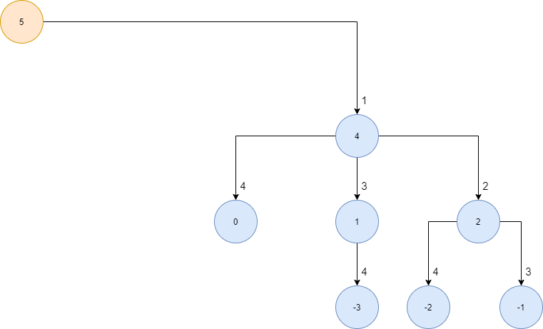
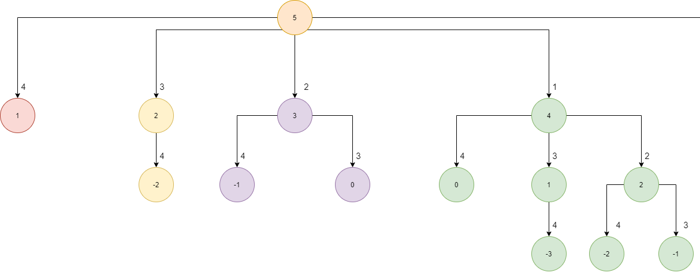

# Desenvolvedores

- Guilherme Rocha Vieira RA: 22.118.024-3
- Thomas Anderson Ferrari RA: 22.118.175-3

# Problema #1 - Menor quantidade de moedas para um valor

<p align="justify">
Nesse problema, dado um valor V em reais e supondo que temos quantidade infinitas de moedas C = {C1, C2, C3,...,Cm} com valores distintos, é necessário encontrar a quantidade mínima de moedas que representam o valor V.
</p>

<p align="justify">
Por exemplo, para V = 62 e C = {25, 4, 3, 1}, precisamos de 2 moedas de 25 e 3 moedas de 4 centavos, ou então {25, 25, 4, 4, 4}, logo a saída deveria ser 5. E ainda utilizando o mesmo valor de V = 62, para C = {25, 16, 15, 4, 3, 1}, precisariamos dessa vez de 2 moedas de 16 e 2 moedas de 15 centavos, ou então {16, 16, 15, 15}, na qual a saída teria que ser 4.
</p>

<p align="justify">
Logo, através desses exemplos é possível verificar que o método por Algoritmos Gulosos é ineficiente, pois somente com determinados exemplos seria possível utilizar ele, como foi no caso do primeiro exemplo, onde bastava escolher as moedas de maior valor para se obter a resposta, contudo, ao adicionar novas moedas para solucionar um mesmo problema V, se o método Guloso ainda fosse utilizado, ele estária errado, já que ele retornaria o mesmo resultado anterior, sendo que utilizando as novas moedas adicionadas seria possível solucionar o problema com menos moedas. Assim, para resolver este problema, foi utilizado os métodos de Programação Dinâmica.
</p>

## Método da Divisão e Conquista

<p align="justify">
Antes de solucionar o problema por Programação Dinâmica, primeiro é necessário resolvê-lo pelo método da Divisão e Conquista, para então encontrar a sub-estrutura ótima e, por fim, desenvolver um algoritmo de maneira bottom-up.
</p>

<p align="justify">
Para solucioná-lo por esse método, basta pegar o valor V e subtrair ele de cada uma das moedas C, desde que a moeda C seja menor do que o valor V, e verificar se o valor foi zerado, se foi, a função retorna 0, caso contrário, ele prossegue para fazer o mesmo com os valores subsequentes até zerar o valor de V, na qual a cada retorno da função, ele soma 1 e retorna para a função que chamou ele dentro da recursão, até voltar para a chamada principal, na qual ele sempre pega o menor valor de retorno entre as funções que foram chamadas.
</p>

<p align="justify">
Exemplo: Para o valor V = 6, e C = {4, 3, 1}, a função vai chamar ela mesma, passando 6 - 4, já que 4 <= 6, assim como o vetor C com as moedas, então na próxima chamada, o valor de V passa a ser 2, como 4 e 3 > 2, eles não serão utilizados, apenas o 1, logo o próximo valor de V = 2 - 1 = 1, então será chamado mais uma vez a função, como 4 e 3 > 1, apenas o 1 será utilizado novamente, chamando pela última vez a função novamente passando V = 1 - 1 = 0, e como V = 0, a função retorna 0, e então a chamada interior soma 1, e isso procede até a última chamada, quando o V = 6, para que então seja realizado as chamadas de V = 6 - 3 e V = 6 - 1. Abaixo é possível ver o grafo gerado pela recursão de V = 6 - 4:
</p>
  
<p align="center">
  
</p>

<p align="justify">
Após a realização de cada recursão é feito uma comparação para verificar qual é o menor número de moedas necessárias para representar o valor V, na qual isso é feito após cada retorno da chamada, para então retornar o melhor valor entre aqueles que foram encontrados, e fazer isso com os retornos subsequentes, assim como abaixo nós temos o grafo completo da recursão desse exemplo, se tivesses que utilizar apenas o grafo para dizer o melhor resultado para esssa questão, basta verificar qual caminho tem o menor número de nós, ou então qual nível chega até o zero primeiro, que nesse caso seria o caminho de  V = 6 - 3 = 3, e após V = 3 - 3 = 0, que retorna no final como saída 2:
</p>

<p align="center">
  
</p>

### Algoritmo Recursivo

Para melhor entender como isso funciona na prática, vamos analisar o algoritmo abaixo:

```javascript
function findMinCoin(coins, change) {
  if (change === 0) {
    return 0;
  }

  let result = Number.MAX_VALUE;

  for (let i = 0; i <= coins.length; i++) {
    if (coins[i] <= change) {
      let tempResult = findMinCoin(coins, change - coins[i]);

      if (tempResult !== Number.MAX_VALUE && tempResult < result) {
        result = tempResult + 1;
      }
    }
  }
  return result;
}
```

<p align="justify">
Primeiro nós temos o caso base que impede que o algoritmo entre dentro de uma chamada recursiva infinita, para sempre retornar 0 quando o valor do 'change', que seria o troco ou o valor V, chegar a 0:
</p>

```javascript
if (change === 0) {
  return 0;
}
```

<p align="justify">
Após nós temos a variavel 'result', que tem a responsabilidade de guardar a quantidade mínima de moedas a serem utilizadas para representar o 'change'. Ela é iniciada sempre com o valor númerico máximo do JavaScript para que quando for realizado uma comparação, seja possível trocar o seu valor para obter um possível valor ótimo, ou então, no caso de não existirem valores que possam representar o 'change', ela vai retornar o valor máximo para que esse caminho seja descartado como uma das possíveis soluções:
</p>

```javascript
let result = Number.MAX_VALUE;
```

<p align="justify">
Por fim é feito uma iteração entre todos os valores do vetor 'coins', que seriam as moedas inseridas pelo usuário, para então verificar se cada uma delas é menor que o valor atual do 'change', e caso seja, a função 'findMinCoins' será chamada novamente, passando como parâmetros o vetor 'coins' e o resultado da subtração entre 'change - coins[i]', na qual a função 'findMinCoins' continuará a ser chamada até o 'change' chegar a 0, ou até não existir mais moedas que sejam menores que o valor de 'change', na qual o valor do retorno será armazenado na variável 'tempResult', que então será utilizada numa condição, primeiro para verificar se o valor dela é diferente do valor máximo, pois caso seja isso significa que o caminho que ele percorreu é inviável, já que nem mesmo existem moedas que possam representar o valor de 'change', e depois ele compara se o valor de 'tempResult' é menor que de 'result', caso seja, o valor de 'result' passa a ser o valor de 'tempResult' + 1, para que então o 'result' sejá utilizando nas próximas iterações, portanto, a função desse laço é sempre buscar encontrar o menor número de moedas entre os possíveis caminhos que ele pode tomar, e no final retornar esse resultado, seja para a chamada principal, ou para as chamadas subsequentes:
</p>

```javascript
for (let i = 0; i <= coins.length; i++) {
  if (coins[i] <= change) {
    let tempResult = findMinCoin(coins, change - coins[i]);

    if (tempResult !== Number.MAX_VALUE && tempResult < result) {
      result = tempResult + 1;
    }
  }
}
return result;
```

## Sub-Estrutura Ótima

<p align="justify">
Ainda utilizando o exemplo do valor V = 6 e C = {4, 3, 1}, é possível perceber no grafo abaixo que quando o algoritmo recursivo é utilizado, ele acaba resolvendo o mesmo problema inúmeras vezes, como a melhor solução para V = 1 (em azul), que aparece 5 vezes, para V = 2 (em vermelho), que aparece 4 vezes, e para V = 3 (em verde), que aparece 2 vezes:
</p>

<p align="center">
  
</p>

<p align="justify">
Logo, seria interessante armazenar esses valores, para que eles possam ser utilizados sempre que o algoritmo se encontrar em uma situação que já foi resolvida anteriormente, e para isso, será necessário utilizar o método de 'bottom-up'
</p>

### Método 'bottom-up'

<p align="justify">
Para solucionar esse problema de forma eficiente, precisamos olhar para ele por baixo, para onde os valores começam a ser retornados na função, pois em vez de tentarmos buscar a melhor solução para V logo de cara, é melhor começar a buscar a melhor solução de cada um dos números que antecedem V, e salvar esses resultados, para que eles possam ser utilizados mais tarde em problemas similares, assim, utilizando o exemplo anterior de V = 6, e C = {4, 3, 1}, vamos criar um vetor para armazenar a melhor solução de cada valor que antecede V, começando do 0 e indo até V, que nesse caso é 6, e iniciar todos os valores com 0:
</p>

| 0   | 1   | 2   | 3   | 4   | 5   | 6   |
| --- | --- | --- | --- | --- | --- | --- |
| 0   | 0   | 0   | 0   | 0   | 0   | 0   |

<p align="justify">
Agora iniciando com V = 1, é necessário realizar uma subtração para cada valor dentro de C que seja menor ou igual a V, que nesse caso só tem apenas o valor 1, e como 1 - 1 = 0, se buscarmos no vetor esse resultado, teremos 0, pois vetor[0] = 1, e como uma moeda foi utilizada, somamos 1 ao valor retornado, para então colocarmos 1 como resultado na posição 1 do vetor: 
</p>

| 0   | 1   | 2   | 3   | 4   | 5   | 6   |
| --- | --- | --- | --- | --- | --- | --- |
| 0   | 1   | 0   | 0   | 0   | 0   | 0   |

<p align="justify">
Prosseguimos então para V = 2, na qual somente o valor 1 poderá ser utilizado, então como 2 - 1 = 1, se buscarmos no vetor esse valor, será retornado 1, e então nós somamos 1 ao valor retornado, e então inserimos esse valor no vetor:      
</p>
          
| 0 | 1 | 2 | 3 | 4 | 5 | 6 |
| - | - | - | - | - | - | - |
| 0 | 1 | 2 | 0 | 0 | 0 | 0 |

<p align="justify">
Agora para o V = 3, nós temos o 1 e 3 que podem ser utilizados, primeiro é feito 3 - 1 = 2, e como o valor retornado é 2, nós somamos 1 que resultará em 3, contudo, ao utilizarmos o valor 3, 3 - 3 = 0, e ao retornar o valor 0 do vetor, teremos 0 + 1 = 1, que é menor que o valor encontrado ao utilizar o valor 1, logo o menor valor será inserido no vetor:
</p>

| 0   | 1   | 2   | 3   | 4   | 5   | 6   |
| --- | --- | --- | --- | --- | --- | --- |
| 0   | 1   | 2   | 1   | 0   | 0   | 0   |

<p align="justify">
E assim o mesmo será feito para os valores subsequentes do vetor, até chegar no valor original de V = 6, na qual, ao ter encontrado as melhores soluções anteriores, basta subtrair das moedas dentro do vetor, e retornar o melhor resultado + 1, dentre aqueles que já foram encontrados: 
</p>

| 0   | 1   | 2   | 3   | 4   | 5   | 6   |
| --- | --- | --- | --- | --- | --- | --- |
| 0   | 1   | 2   | 1   | 1   | 2   | 2   |

### Algoritmo por Programação Dinâmica

Agora vamos analisar o algoritmo por programação dinâmica:

```javascript
function findMinCoins(coins, change) {
  let savedResults = [];
  for (let i = 0; i <= change; i++) {
    savedResults[i] = 0;
  }

  for (let i = 1; i <= change; i++) {
    let currentChange = i;
    let bestCount = Number.MAX_VALUE;
    for (let j = 0; j < coins.length; j++) {
      if (coins[j] <= currentChange) {
        let count = savedResults[currentChange - coins[j]] + 1;

        if (bestCount > count) {
          bestCount = count;
        }
      }
    }
    savedResults[i] = bestCount;
  }

  return savedResults[change];
}
```

<p align="justify">
Primeiro nós precisamos inicializar o vetor 'savedResults', que irá salvar os melhores resultados de 0 até 'change'(valor de V), com 0:
</p>

```javascript
let savedResults = [];
for (let i = 0; i <= change; i++) {
  savedResults[i] = 0;
}
```

<p align="justify">
Após, iremos percorrer um laço começando do 1 até 'change', sempre iniciando a variavel 'currentChange' = i, que representa o troco, ou valor V, atual, e depois inicializamos 'bestCount' com o valor máximo do JavaScript. Dentro desse laço nós temos outro laço que percorre todas as moedas do vetor 'coins', na qual foi adicionado uma condição para ele entrar somente quando as moedas forem menores que o valor de 'currentChange'. Então, dentro desse laço, ele procura um valor correspondente no index do vetor 'savedResults' que seja igual a 'currentChange' - 'coins[j]', que seria o valor atual de V menos as moedas que são menores que V, soma + 1, já que uma moeda foi utilizada, para então no final do laço realizar uma comparação entre cada um desses valores encontrados e pegar o melhor entre eles, e após terminar esse laço, o melhor resultado é salvo no vetor 'savedResults' antes da próxima iteração do laço principal, e depois de finalizar o laço principal, a função retorna o melhor resultado para o valor V:
</p>

```javascript
for (let i = 1; i <= change; i++) {
  let currentChange = i;
  let bestCount = Number.MAX_VALUE;
  for (let j = 0; j < coins.length; j++) {
    if (coins[j] <= currentChange) {
      let count = savedResults[currentChange - coins[j]] + 1;

      if (bestCount > count) {
        bestCount = count;
      }
    }
  }
  savedResults[i] = bestCount;
}
```

## Análise Assintótica

<p align="justify">
Como é possível verificar no algoritmo, a parte que mais pesa nele é o laço que passa por todas as moedas que está dentro do laço principal que vai de 1 até V: 
</p>
  
```javascript
for (let i = 1; i <= change; i++) {
  let currentChange = i;
  let bestCount = Number.MAX_VALUE;
  for (let j = 0; j < coins.length; j++) {
    if (coins[j] <= currentChange) {
      let count = savedResults[currentChange - coins[j]] + 1;

      if (bestCount > count) {
        bestCount = count;
      }
    }

}
savedResults[i] = bestCount;
}

```
<p align="justify">
Logo a complexidade desse algoritmo é O(V*C), na qual V seria o valor do troco, ou então o valor a ser representado, enquanto C seria o tamanho do vetor que contêm as moedas. No pior caso, onde C = V, a complexidade do algoritmo passa a ser O(V^2), ou então O(n^2), supondo que seja realizado um filtro no vetor que contêm as moedas para retirar os valores que são maiores que o valor de V.
</p>

## Interface

<p align="center">
  
</p>

# Problema #2 - Contagem de subconjuntos com soma X

<p align="justify">
Nesse problema, dado um vetor arr de tamanho N e um inteiro X, é necessário encontrar a quantidade de subconjuntos de arr que conseguem representar o valor de X.
</p>

<p align="justify">
Por exemplo, para arr = {1, 1, 2, 3, 4} e X = 5, a saída deverá ser 4, pois nós temos 4 subconjuntos que representam X: {1, 4}, {1, 4}, {2, 3} e {1, 1, 3}. Ou então para arr = {1, 2, 3, 4, 5} e X = 10, a saída deverá ser 3, pois teremos 3 subconjuntos que representam X: {1, 4, 5}, {2, 3, 5} e {1, 2, 3, 4}.
</p>

## Método da Divisão e Conquista

<p align="justify">
Para resolver este problema por divisão e conquista, é necessário pegar o valor de X e subtrair dele cada um dos valores contidos no vetor arr, e para cada caminho subsequente, é necessário descontar do vetor os valores que já foram utilizados, para que não sejam criados caminhos repetidos, por exemplo, para arr = {1, 2, 3, 4} e X = 5, se eu fizer 5 - 1 = 4, para o primeiro caminho, no caminho gerado a partir dele eu não poderei usar o 1 novamente, os únicos que eu poderei usar são os valores {2, 3, 4}, e então isso é feito até o valor inicial de X = 0, o que significa que foi encontrado um subconjunto capaz de representar X, logo contar esse caminho para encontrar a solução final, e no caso de X < 0 esse caminho é descartado. 
</p>
  
<p align = "justify">
Para melhor visualizar essa solução por divisão e conquista, vamos utilizar o exemplo arr = {1, 1, 2, 3, 4} e X = 5, e visualizar a resolução pelo grafo abaixo:
</p>

<p align="center">
  
</p>

Primeiro é necessário subtrair X do primeiro valor do vetor, ficando 5 - 1 = 4, dessa forma, no próximo caminho sobraram apenas {1, 2, 3, 4} para serem utilizados, na qual cada um deles será utilizado em uma subtração com o nó atual = 4, até o valor de X <= 0 ou então quando não existirem mais valores a serem utilizados, como mostrado no grafo completo dessa resolução abaixo:

<p align="center">
  
  
</p>

Assim, basta contar os nós que chegaram ao resultado 0, e ignorar os outros, que teremos a saída do problema, onde nesse caso seria 4, pois temos as saídas: {1, 1, 3}, {1, 4}, {1, 4} e {2, 3}.

### Algoritmo Recursivo

Para melhor entender como isso funciona na prática, vamos analisar o algoritmo abaixo:

```javascript
function countSumSubsets(arr, x, count, index) {
  if (x === 0) {
    count++;
    return count;
  }

  for (let i = index, j = 1; i < arr.length; i++, j++) {
    count = countSumSubsets(arr, x - arr[i], count, index + j);
  }

  return count;
}
```

<p align="justify">
Primeiro nós temos o caso base que impede que o algoritmo entre dentro de uma chamada recursiva infinita, para sempre incrementar o contador count e retornar o seu valor para a chamada anterior quando o valor do X chegar a 0, o que significa que foi encontrado um subconjunto que tenha uma soma de seus elementos igual a X:
</p>

```javascript
if (x === 0) {
  count++;
  return count;
}
```

<p align="justify">
Após nós temos um laço que inicia do index até o tamanho do array, sempre que essa função é chamada inicialmente o index = 0, e dentro desse laço nós temos uma chamada para a própria função, na qual seu resultado é retornado para o contador count, na qual ele chama a própria função passando o vetor arr, que sempre será o mesmo, o valor de x - arr[i], que seria a subtração de X - os valores disponíveis do vetor arr, o próprio contador count, e o index + j, que é uma das váriaveis mais importantes nessa chamada, pois ela impede que as variaveis do vetor arr que já foram utilizados, não sejam usados na próxima chamada da função, igual nos exemplos já mencionados:
</p>

```javascript
for (let i = index, j = 1; i < arr.length; i++, j++) {
  count = countSumSubsets(arr, x - arr[i], count, index + j);
}
```

<p align="justify">
Por fim a função retorna o valor do contador count, que será utilizado quando o valor de X !== 0, como também será responsável por retornar o valor final da saída do problema:
</p>

```javascript
return count;
```

## Sub-Estrutura Ótima

<p align="justify">
Ainda utilizando o exemplo do arr = {1, 1, 2, 3, 4} e X = 5, é possível perceber no grafo da resolução abaixo, que ele acaba resolvendo o mesmo problema até 4 vezes, sendo eles 4-4, 4-3, 4-2 e 3-3, nesse caso é importante notar que ambos os nós 4 não são iguais, logo não seria possível considerá-los como uma resolução só, pois enquanto o primeiro nó 4, mais pra esquerda, tem 4 caminhos diferentes que pode seguir, o nó 4, mais pra direita, tem apenas 3:
</p>

<p align="center">
  
  
</p>

<p align="justify">
Logo, é necessário armazenar esses valores para criar uma solução por programação dinâmica.
</p>

### Método 'bottom-up'

<p align="justify">
Para solucionar esse problema de forma eficiente, precisamos solucioná-lo primeiro por baixo, para depois ir caminhando até o problema que precisa ser resolvido utilizando os valores dos problemas já solucionados. Portanto, para resolver esse problema vamos utilizar o mesmo exemplo anterior, arr = {1, 1, 2, 3, 4} e X = 5, além disso, nós precisamos criar uma matriz com X colunas e N linhas, iniciando do 0, na qual N seria o tamanho do vetor arr, zerando todos os seus elementos, com excessão de todas as colunas na posição 0:
</p>

|  -  | 0   | 1   | 2   | 3   | 4   | 5   | 
| --- | --- | --- | --- | --- | --- | --- |
| 0   |  1  | 0   | 0   | 0   | 0   |  0  |
| 1(1)  |  1  | 0   | 0   | 0   | 0   |  0  |
| 2(1)  |  1  | 0   | 0   | 0   | 0   |  0  |
| 3(2)  |  1  | 0   | 0   | 0   | 0   |  0  |
| 4(3)  |  1  | 0   | 0   | 0   | 0   |  0  |
| 5(4)  |  1  | 0   | 0   | 0   | 0   |  0  |

<p align="justify">
Para a solução desse problema é necessário resolver linha a linha da matriz, começando do primeiro elemento do vetor arr até o último, e funciona da seguinte forma: começando da linha 1, nós subtraímos todas as colunas subsequentes, com excessão da coluna 0, do primeiro elemento do vetor arr, ou seja, para o exemplo em questão seria: 1 - 1 = 0, 2 - 1 = 1, 3 - 1 = 2, e por ai vai... Porém, quando é feita essa subtração, nós olhamos para o vetor de cima e verificamos a coluna igual ao resultado obtido, logo, para 1 - 1 = 0, olhamos para a linha 0 e para a coluna 0, onde temos o valor 1, e adicionamos esse valor para a linha e coluna que estávamos utilizando, que seria a coluna 1 e linha 1, e também somamos como valor da linha de cima, mantêndo a coluna, que seria a linha 0 e coluna 1 que resultam e zero, e ao popular a linha 1 e coluna 1 ela passaria a ter o valor 1, o que isso significa é que existe 1 forma de representar o valor 1, porém se fizermos isso com o resto das colunas e verificando o valor de cima, permanecerá zerado, pois o número 1 sózinho não consegue representá-los:
</p>

|  -  | 0   | 1   | 2   | 3   | 4   | 5   | 
| --- | --- | --- | --- | --- | --- | --- |
| 0   |  1  | 0   | 0   | 0   | 0   |  0  |
| 1(1)  |  1  | 1   | 0   | 0   | 0   |  0  |
| 2(1)  |  1  | 0   | 0   | 0   | 0   |  0  |
| 3(2)  |  1  | 0   | 0   | 0   | 0   |  0  |
| 4(3)  |  1  | 0   | 0   | 0   | 0   |  0  |
| 5(4)  |  1  | 0   | 0   | 0   | 0   |  0  |

<p align="justify">
Agora para a segunda linha, onde temos o segundo elemento do vetor = 1, nós fazemos o mesmo que no anterior, subtrai todas as colunas, com excessão da coluna 0, do segundo elemento do vetor, e apesar dos dois elementos serem iguais, teremos dois resultados diferentes, primeiro que na coluna um, agora teremos dois valores que podem representar o número 1, e além disso, na coluna 2, teremos um subconjunto de valores capazes de representar o valor 2, que seria {1, 1}, pois ao subtrair 2 - 1 = 1, e se olharmos na linha 1 coluna 1, teremos outro valor que não seja o 1 atual para poder representar o 2, logo o valor 1 é adicionado na coluna 2 da linha 1, pois até esse momento nós temos 2 valores que representam o número 2:
</p>

|  -  | 0   | 1   | 2   | 3   | 4   | 5   | 
| --- | --- | --- | --- | --- | --- | --- |
| 0   |  1  | 0   | 0   | 0   | 0   |  0  |
| 1(1)  |  1  | 1   | 0   | 0   | 0   |  0  |
| 2(1)  |  1  | 2   | 1   | 0   | 0   |  0  |
| 3(2)  |  1  | 0   | 0   | 0   | 0   |  0  |
| 4(3)  |  1  | 0   | 0   | 0   | 0   |  0  |
| 5(4)  |  1  | 0   | 0   | 0   | 0   |  0  |

<p align="justify">
Agora para a linha 3, nós teremos o terceiro elemento do vetor, que seria o 2, então é feito novamente a subtração, porém nas colunas onde o 2 não tem influência, ele mantém as que já foram encontradas, ou seja, como 2 > 1, ele mantém o valor da coluna 1 anterior que foi encontrada, e o mesmo é feito para todos os campos onde os valores do vetor são maiores que as colunas no momento da subtração, e após isso, teremos e formas de representar o 2, que seria {2} e {1, 1}, e 2 formas de representar o 3, {1, 2}, {1, 2}, pois quando é feito 3 - 2 = 1, e se olharmos na linha de cima, teremos duas formas de representar o 1, logo, ao somar a coluna 3 da linha 2, que tem o valor 0, com a coluna e linha atual, teremos o valor 2, além de uma forma de representar o 4, que seria {2, 1, 1}, como mostrado abaixo:
</p>

|  -  | 0   | 1   | 2   | 3   | 4   | 5   | 
| --- | --- | --- | --- | --- | --- | --- |
| 0   |  1  | 0   | 0   | 0   | 0   |  0  |
| 1(1)  |  1  | 1   | 0   | 0   | 0   |  0  |
| 2(1)  |  1  | 2   | 1   | 0   | 0   |  0  |
| 3(2)  |  1  | 2   | 2   | 2   | 1   |  0  |
| 4(3)  |  1  | 0   | 0   | 0   | 0   |  0  |
| 5(4)  |  1  | 0   | 0   | 0   | 0   |  0  |

<p align="justify">
E assim nós vamos populando a matriz até chegar no último valor do vetor arr, dessa forma, em vez de utilizarmos todos os valores do vetor de uma vez, nós vamos adicionando cada um aos poucos, e vamos resolvendo com os valores que temos no momento, para então utilizar as soluções de agora para solucionarmos os próximos problemas, além disso é importante notar que a razão de adicionar uma linha a mais na matriz é porquê sempre que você olha para a linha anterior da matriz, você está olhando para uma solução que não utiliza o elemento do vetor que você está usando no momento, ou seja, se eu estou usando o elemento 2 para fazer as subtrações, se eu olhar para a linha anterior, nela eu utilizei as os elementos {1, 1}, e dessa forma eu não corro o risco de utilizar o mesmo elemento mais de uma vez, que é exatamente o que aconteceria se eu olhasse para a minha própria linha. Abaixo nós temos a solução da matriz:
</p>

|  -  | 0   | 1   | 2   | 3   | 4   | 5   | 
| --- | --- | --- | --- | --- | --- | --- |
| 0   |  1  | 0   | 0   | 0   | 0   |  0  |
| 1(1)  |  1  | 1   | 0   | 0   | 0   |  0  |
| 2(1)  |  1  | 2   | 1   | 0   | 0   |  0  |
| 3(2)  |  1  | 2   | 2   | 2   | 1   |  0  |
| 4(3)  |  1  | 2   | 2   | 3   | 3   |  2  |
| 5(4)  |  1  | 2   | 2   | 3   | 4   |  4  |

<p align="justify">
Dessa forma, se olharmos para a última linha e coluna do vetor, nós obtemos a solução do problema, que seria 4, já que os subconjuntos que formam o valor X = 5 são: {1, 4}, {1, 4}, {2, 3} e {1, 1, 3}, porém, ele também pode mostrar a quantidade de subconjuntos que formam os valores de 1-4 se olharmos para a última linha, como, por exemplo, o valor 4, que tem como saída 4, pois os vetores que formam ele seriam {4}, {3, 1}, {3, 1} e {1, 1, 2}. Além disso, é importante citar que o vetor arr não precisa estar ordenado para chegar nessa solução, como podemos ver abaixo no caos do vetor arr = {3, 1, 4, 2, 1}:
</p>

|  -  | 0   | 1   | 2   | 3   | 4   | 5   | 
| --- | --- | --- | --- | --- | --- | --- |
| 0   |  1  | 0   | 0   | 0   | 0   |  0  |
| 1(3)  |  1  | 0   | 0   | 1   | 0   |  0  |
| 2(1)  |  1  | 1   | 0   | 1   | 1   |  0  |
| 3(4)  |  1  | 1   | 0   | 1   | 2   |  1  |
| 4(2)  |  1  | 1   | 1   | 2   | 2   |  2  |
| 5(1)  |  1  | 2   | 2   | 3   | 4   |  4  |

### Algoritmo por Programação Dinâmica

Agora vamos analisar o algoritmo por programação dinâmica:

```javascript
function countSumSubsets(arr, x) {
  let matrix = [];

  for (let i = 0; i <= arr.length; i++) {
    matrix[i] = [];
    for (let j = 0; j <= x; j++) {
      if (j === 0) {
        matrix[i][j] = 1;
      } else {
        matrix[i][j] = 0;
      }
    }
  }

  for (let i = 1; i <= arr.length; i++) {
    for (let j = 1; j <= x; j++) {
      if (j - arr[i - 1] >= 0) {
        matrix[i][j] += matrix[i - 1][j - arr[i - 1]] + matrix[i - 1][j];
      } else {
        matrix[i][j] = matrix[i - 1][j];
      }
    }
  }

  return matrix[arr.length][x];
}
```
<p align="justify">
Primeiro nós temos a criação da matriz matrix e sua inicialização, populando todos os seus campos com o valor 0, com excessão das colunas que sejam iguais a 0:
</p>

```javascript
let matrix = [];

for (let i = 0; i <= arr.length; i++) {
  matrix[i] = [];
  for (let j = 0; j <= x; j++) {
    if (j === 0) {
      matrix[i][j] = 1;
    } else {
      matrix[i][j] = 0;
    }
  }
}
```
<p align="justify">
Após nós temos um laço que percorre todas as linhas da matriz, começando da linha 1, e todas as colunas, também iniciando da coluna 1, na qual, dentro do segundo laço é realizado o processo de popular a matriz, onde primeiro temos uma condição para verificar se a subtração da coluna j com o elemento do vetor arr[i - 1] é maior que zero, igual o que foi feito no exemplo anterior, pois caso seja, ele realiza uma soma dos valores contidos na matriz atual, juntamente com os valores da coluna de cima e também da coluna e linha anteriores que foram verificadas, caso contrário, ele apenas mantém os valores da linha e coluna de cima:
</p>

```javascript
for (let i = 1; i <= arr.length; i++) {
  for (let j = 1; j <= x; j++) {
    if (j - arr[i - 1] >= 0) {
      matrix[i][j] += matrix[i - 1][j - arr[i - 1]] + matrix[i - 1][j];
    } else {
      matrix[i][j] = matrix[i - 1][j];
    }
  }
}
```

<p align="justify">
Por fim, ele retorna o valor da última linha e coluna, que contém a saída do problema:
</p>

```javascript
return matrix[arr.length][x];
```
